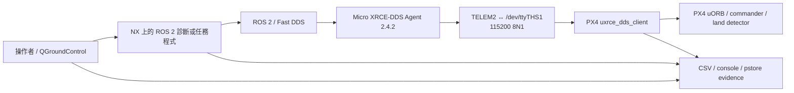

# P450 系統與 repository 地圖

這份文件說明系統怎麼連接、repository 各區放什麼，以及目前哪些結論有證據支持。
內容以 2026-08-31 的 `b180a91` 盤點快照為基準；若要查看後續變更，請回到
[`README.md`](../../README.md) 和[分支清單](../current/BRANCH_INVENTORY_20260831.md)。

## 盤點基準

| 項目 | 內容 |
| --- | --- |
| Repository | `https://github.com/DDlic/p450-jetson-handoff.git` |
| 主分支 | `main` |
| 基準 commit | `b180a91a18d1bd34ed80d63680c50fba0b3842a3` |
| 盤點日期 | 2026-08-31（Asia/Taipei） |

這不是可直接建置的 ROS package。Repository 沒有 package manifest、lockfile、頂層建置系統或
CI workflow；可執行的內容主要是 Python 診斷程式與 shell 工具。它的用途是把韌體來源、patch、
測試證據和操作限制放在同一條可追查的路徑上。

## 系統怎麼連接

Jetson Xavier NX 使用 ROS 2 Foxy 和 Micro XRCE-DDS Agent 2.4.2；版本與 transport 基準見
[`P450_RELIABLE_LATENCY_REMEDIATION_RUNBOOK_2026-08-17.md`](../runbooks/P450_RELIABLE_LATENCY_REMEDIATION_RUNBOOK_2026-08-17.md)。
Agent service 以 `p450` 使用者執行，透過 `/dev/ttyTHS1`、115200 baud 與 Pixhawk 6C 的 TELEM2 通訊
（[`systemd/p450-micro-xrce-agent.service`](../../systemd/p450-micro-xrce-agent.service)）。
NX 的軟體與 UART 基準記錄在
[`QGC_LAPTOP_CODEX_HANDOFF_20260814.md`](../current/QGC_LAPTOP_CODEX_HANDOFF_20260814.md)；
PX4 `/fmu/*` topic 的實際發現紀錄則保存在
[`20260810_163557_px4_v1143_ping_postflash`](../../evidence/20260810_163557_px4_v1143_ping_postflash/SUMMARY.md)。
這些是特定環境中的觀測，不是能從本 repository 自動安裝的依賴。



115200 8N1 的理論上限是每方向 11,520 bytes/s。UART 雖然是全雙工，兩個方向仍共用 XRCE
session 狀態，也會受到 PX4 task 與 queue/drain 行為影響。不能把兩個方向的流量直接相加成
「同一條 wire 的總量」，但 PX4 輸出負載仍可能拖慢輸入處理。計算與限制詳見
[`20260813_first_principles_offboard_transport/SUMMARY.md`](../../evidence/20260813_first_principles_offboard_transport/SUMMARY.md)。

## 目錄怎麼分工

| 目錄 | 放置內容 | 修改原則 |
| --- | --- | --- |
| `docs/` | 導覽、目前交接、runbook、報告與歷史文件 | 目錄或權威關係改變時一併更新 |
| `scripts/` | ROS 2 monitor、probe 與 NX 儲存工具 | 本機可做靜態檢查；實機測試需匹配的 NX 環境 |
| `systemd/` | Micro XRCE-DDS Agent service 定義 | 整理文件時不得安裝或重啟 service |
| `patches/` | PX4 XRCE 修改 | 保留 patch，並連回對應韌體與證據 |
| `firmware/` | PX4 韌體與 SHA-256 manifest | 先驗證 checksum；repository 檢查不等於授權刷寫 |
| `evidence/` | 依時間保存的摘要、CSV、console、trace 與 pstore | 原始觀測只增不改 |
| `docs/raw/` | 測試條件不完整的筆記與 captures | 保留原文，不拿來支持已驗證結論 |
| `config/` | NX runtime、SD-first 儲存規則與區域說明 | 保留 eMMC／SD 安全限制 |
| `.agents/skills/p450-repo-curator/` | Repository 整理與稽核工具 | 文件變更後重新執行稽核 |

基準快照包含 47 個 Markdown 檔、20 個有時間戳的 evidence 目錄、10 個 `.px4` 韌體、
11 個 patch、7 個 Python 檔、7 個 CSV，以及 `scripts/` 下的 10 個項目。韌體約 18 MB，
evidence 約 2 MB。NX 上的新 clone、build、log 與測試輸出應放在 SD 卡，不要寫入 14 GB eMMC
（[`config/AGENTS.md`](../../config/AGENTS.md)）。

未合併的 `work/*` 分支屬於開發紀錄，不會自動取代 `main` 的索引與結論。分支用途和保留方式見
[`BRANCH_INVENTORY_20260831.md`](../current/BRANCH_INVENTORY_20260831.md)。

## 程式與 topic

### 唯讀診斷

- [`p450_ros2_link_monitor.py`](../../scripts/p450_ros2_link_monitor.py) 訂閱
  `/fmu/out/sensor_combined`，使用 Best-Effort QoS 計算接收間隔。
- [`p450_sensor_static_check.py`](../../scripts/p450_sensor_static_check.py) 訂閱
  `SensorCombined` 和 `VehicleAttitude`，檢查靜止狀態下的數值是否合理。
- [`p450_local_position_gap_monitor.py`](../../scripts/p450_local_position_gap_monitor.py) 分別計算
  `/fmu/out/vehicle_local_position` 的本機接收間隔和來源 timestamp 間隔。

### 有保護條件的發布與控制診斷

- [`p450_offboard_heartbeat_probe.py`](../../scripts/p450_offboard_heartbeat_probe.py) 只發布
  `OffboardControlMode`，可選 Best-Effort 或 Reliable；偵測到已解鎖或進入 Offboard 時會停止。
- [`p450_offboard_ground_probe.py`](../../scripts/p450_offboard_ground_probe.py) 發布 heartbeat 與定點
  setpoint，不發布 `VehicleCommand`；車輛解鎖時通常會退出。
- [`p450_offboard_arm_cycle.py`](../../scripts/p450_offboard_arm_cycle.py) 只有在 status、Offboard、
  failsafe 與 preflight 條件通過後，才會發出一般的 arm/disarm 指令。它是無槳診斷工具，
  不是自主飛行任務。

### PX4 端的 XRCE 流量控制

Rate-limit patch 將 PX4 輸出縮減為六個 topic：local position 為 10 Hz，其餘五個 status／navigation
topic 為 5 Hz；同時移除 `position_setpoint_triplet` 和 `timesync_status` 輸出，輸入端不變。
後續 Reliable patch 只把時效敏感的 Offboard heartbeat 改為 Reliable。詳細改動與 600 秒測試結果見
[`SUMMARY.md`](../../evidence/20260813_first_principles_offboard_transport/SUMMARY.md) 和
[`TEN_MINUTE_RELIABLE_RESULT.md`](../../evidence/20260813_first_principles_offboard_transport/TEN_MINUTE_RELIABLE_RESULT.md)。

## 目前有證據支持的結論

| 觀測 | 結果 | 能說明的範圍 |
| --- | --- | --- |
| Best-Effort heartbeat，60 秒 | NX 發布 601 筆，PX4 收到 586 筆；最大間隔 307.002 ms | 該測試條件下有漏收，且超過 250 ms 門檻 |
| Reliable heartbeat，600 秒 | 發布與收到皆為 6001 筆；最大間隔 601.548 ms | 最終送達數相同，但 freshness 仍未通過 |
| 同一 Reliable 測試 | 16 次超過 250 ms，2 次超過 500 ms | Reliable 送達不等於每筆準時 |
| NX kernel | 保存兩次同類型 `key_garbage_collector → key_put()` panic | Kernel 關卡未通過 |

Best-Effort 數據來自
[`SUMMARY.md`](../../evidence/20260813_first_principles_offboard_transport/SUMMARY.md)，Reliable 數據來自
[`TEN_MINUTE_RELIABLE_RESULT.md`](../../evidence/20260813_first_principles_offboard_transport/TEN_MINUTE_RELIABLE_RESULT.md)。
`601.548 ms` 低於該次測試設定的 `COM_OF_LOSS_T=1.0 s`，但超過本專案的 250 ms 工程門檻。
兩次同類型 kernel panic 的保存範圍與判讀記錄在
[`20260817_nx_kernel_panic_key_gc_repeat`](../../evidence/20260817_nx_kernel_panic_key_gc_repeat/README.md)。

目前證據無法指出第一個遺失 frame 發生在 Fast DDS、Agent queue、UART driver／電氣路徑或 Pixhawk
UART 的哪一段，也沒有建立解鎖後或室外環境的最差延遲上限。現有結果只能支持以下判讀：

1. Reliable 在這次測試中消除了最終筆數差異。
2. Reliable 沒有證明 250 ms deadline 能穩定通過。
3. `601.548 ms` 單一結果不能證明受限 PoC 必然失敗；它也不能支持一般飛行安全結論。
4. Delivery PoC 仍受 runbook 的範圍、operator control 與停止條件限制。
5. `not landed` 應按狀態轉換處理：等待 PX4 Land 和 landed confirmation，再正常 disarm，不能用 forced disarm 繞過。

## 本機可以檢查什麼

```bash
python3 -m compileall -q scripts .agents/skills/p450-repo-curator/scripts
python3 .agents/skills/p450-repo-curator/scripts/audit_repo.py --base-ref origin/main
(cd firmware && sha256sum -c SHA256SUMS)
git diff --check
git diff --name-status --find-renames origin/main
```

這些命令能檢查 Python 語法、文件連結、韌體檔案 checksum 和是否誤刪 tracked file。它們不能載入
ROS package、驗證 NX kernel、模擬 PX4 行為或授權實機操作。

ROS 2 程式需要匹配韌體的 `px4_msgs` 與 `rclpy` 環境；Agent 和 UART 檢查需要 NX 的
`/dev/ttyTHS1`，PX4 接收計數則需要 QGC／PX4 console。基準快照沒有 CI workflow，也沒有可重現
1 m／5 m／Land 任務的 SITL package，因此目前的自動化上限是靜態檢查與 evidence 一致性檢查。

## 證據怎麼一路連到操作決定

```text
原始 CSV / console / pstore
  -> 同一 TEST_ID 的 evidence summary
  -> firmware、patch 與測試條件
  -> current runbook 的許可與停止條件
  -> README / index 的摘要
```

[`DOC_INVENTORY.md`](../current/DOC_INVENTORY.md) 記錄文件分類與權威關係。舊報告與 handoff 保留在
`docs/reports/` 和 `docs/history/`，用來追查當時的判斷，不會因日期較早就被刪除。

`firmware/SHA256SUMS` 只證明 repository 中的檔案符合 manifest。任何經授權的 reflash 之前，仍須依
[`firmware/README.md`](../../firmware/README.md) 移除槳葉、備份參數、確認板型並完成地面測試。

## 尚未補齊的項目

- ROS 2／PX4 Python 環境沒有 lockfile 或 environment manifest。
- 基準快照沒有執行並驗證 1 m／5 m／Land state machine 的 SITL 任務。
- 基準快照沒有自動檢查連結、Python 語法、checksum 與誤刪檔案的 CI。
- 部分歷史報告後來追加內容，檔名日期不一定等於最後編輯日期。
- 少數 raw note 與 ULog capture 缺少完整 TEST_ID 或來源資訊，因此只放在 `docs/raw/`。
- XRCE loss／recovery 的確切來源仍未確認；做高風險 transport redesign 前應先建立可驗證的 evidence map。

可以直接檢查 repository layout、service 設定、程式使用的 topic／QoS、firmware checksum 和已保存的
CSV／receipt count。Reliable recovery 是否造成目前觀測到的 tail 仍是推論；解鎖後的室外最大間隔、
完整起降時 land detector 的行為，以及自主路線能否成功，目前都沒有相符的完整飛行證據。
