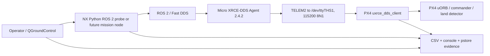

# P450 repository architecture and evidence map

## Executive summary

This repository is an evidence-backed operations handoff for a Jetson Xavier NX running ROS 2 Foxy, a Micro XRCE-DDS Agent over 115200-baud UART, and a Pixhawk 6C running several evaluated PX4 firmware variants. It is not a self-contained application repository: no package manifest, lockfile, top-level build system, or CI workflow is present. Its executable surface is a small set of Python diagnostics and shell helpers; its main value is the linkage among firmware/patch provenance, timestamped experiment evidence, and current safety/runbook decisions. The immediate architecture problem is therefore information authority and reproducibility, not framework modernization.

Repository identity at inventory time:

- Remote: `https://github.com/DDlic/p450-jetson-handoff.git`
- Trunk: `main`
- Baseline: `b180a91a18d1bd34ed80d63680c50fba0b3842a3`
- Inventory date: 2026-08-31 (Asia/Taipei)

## System context

The installed Agent service binds `/dev/ttyTHS1` at 115200 baud and launches MicroXRCEAgent as user `p450` (`systemd/p450-micro-xrce-agent.service:7-16`). The repository states that the NX environment has ROS 2 Foxy, Micro XRCE-DDS Agent 2.4.2, `px4_msgs`, and `px4_ros_com`, and that ROS 2 can discover the PX4 `/fmu/*` graph (`README.md:105-107`). These are environment observations, not dependencies installable from this repository.



The UART is full duplex with a theoretical 11,520 bytes/s in each direction, but both directions still share XRCE session state, PX4 task time, and queue/drain behavior (`evidence/20260813_first_principles_offboard_transport/SUMMARY.md:31-46`). This is why “sum both directions as one wire” is wrong while “PX4 output load can delay input work” remains plausible.

## Repository zones

| Zone | Role | Change policy |
|---|---|---|
| `docs/` | Navigation, architecture, current authority map, then classified reports/runbooks | Update with every topology or authority change |
| `scripts/` | ROS 2 probes/monitors and NX storage helpers | Static-check locally; hardware tests require matching NX environment |
| `systemd/` | Canonical Agent service unit | Do not install/restart from repository cleanup work |
| `patches/` | Reviewable PX4 XRCE deltas | Preserve; link to firmware and evidence |
| `firmware/` | Built PX4 artifacts plus SHA-256 manifest | Immutable artifact identity; verify checksum before any authorized use |
| `evidence/` | Timestamped summaries, CSV, console, trace, and pstore captures | Append-only; never rewrite raw observations |
| `docs/raw/` | Unverified notes and captures without a complete test context | Preserve bytes; do not promote to evidence-backed conclusions |
| `config/` | NX storage/runtime helpers and subtree instructions | Preserve eMMC/SD safety policy |
| `.agents/skills/p450-repo-curator/` | Repeatable repository classification and validation workflow | Validate after edits |

At the baseline there are 47 Markdown files, 20 timestamped evidence directories, 10 `.px4` firmware files, 11 patch files, 7 Python files, 7 CSV files, and 10 entries under `scripts/`. Firmware is about 18 MB and evidence about 2 MB; storage pressure and generated test output belong on the NX SD card, not eMMC (`config/AGENTS.md:3-15`).

Branch intent and preserved former tips are tracked separately in
[`docs/current/BRANCH_INVENTORY_20260831.md`](../current/BRANCH_INVENTORY_20260831.md).
Unmerged `work/*` branches are development records, not automatic authority over
the curated `main` indexes.

## Runtime and topic surface

### Read-only observation

- `p450_ros2_link_monitor.py` subscribes to `/fmu/out/sensor_combined` with Best-Effort QoS and measures arrival gaps (`scripts/p450_ros2_link_monitor.py:20-35`).
- `p450_sensor_static_check.py` subscribes to `SensorCombined` and `VehicleAttitude` for stationary plausibility checks (`scripts/p450_sensor_static_check.py:21-48`).
- `p450_local_position_gap_monitor.py` separates local arrival gaps from source timestamp gaps on `/fmu/out/vehicle_local_position` (`scripts/p450_local_position_gap_monitor.py:16-36`).

### Guarded publication and control diagnostics

- `p450_offboard_heartbeat_probe.py` publishes only `OffboardControlMode`, supports selectable Best-Effort/Reliable publisher QoS, and aborts when armed or entering Offboard (`scripts/p450_offboard_heartbeat_probe.py:1-7`, `scripts/p450_offboard_heartbeat_probe.py:26-63`).
- `p450_offboard_ground_probe.py` publishes an Offboard heartbeat plus hold-position setpoint, never `VehicleCommand`, and normally exits if the vehicle arms (`scripts/p450_offboard_ground_probe.py:1-6`, `scripts/p450_offboard_ground_probe.py:56-71`).
- `p450_offboard_arm_cycle.py` can publish normal (never forced) arm/disarm commands only after status, Offboard, failsafe, and preflight prerequisites pass (`scripts/p450_offboard_arm_cycle.py:48-60`, `scripts/p450_offboard_arm_cycle.py:63-76`). It is a propeller-free diagnostic, not the requested autonomous mission implementation.

### Firmware-side XRCE shaping

The rate-limited patch reduces PX4 output publications to six named topics: local position at 10 Hz and five status/navigation topics at 5 Hz, while removing `position_setpoint_triplet` and `timesync_status` outputs and leaving inputs unchanged (`evidence/20260813_first_principles_offboard_transport/SUMMARY.md:94-125`). The later reliable patch changes only the deadline-critical Offboard heartbeat path to Reliable; the stored 600-second result documents both eventual delivery and the remaining tail (`evidence/20260813_first_principles_offboard_transport/TEN_MINUTE_RELIABLE_RESULT.md:26-36`, `evidence/20260813_first_principles_offboard_transport/TEN_MINUTE_RELIABLE_RESULT.md:112-121`).

## Current decision state

### What is directly supported

- Best-Effort 60-second heartbeat: NX published 601, PX4 received 586, with a 307.002 ms PX4 maximum gap (`evidence/20260813_first_principles_offboard_transport/SUMMARY.md:170-194`).
- Reliable 600-second heartbeat: 6001/6001 eventual receipt, 601.548 ms maximum receipt gap, and 16/2 occurrences above 250/500 ms (`evidence/20260813_first_principles_offboard_transport/TEN_MINUTE_RELIABLE_RESULT.md:5-24`).
- The 601.548 ms event was below the configured 1.0-second Offboard-loss timeout in that field, while still failing the repository's stricter 250 ms engineering gate (`evidence/20260813_first_principles_offboard_transport/TEN_MINUTE_RELIABLE_RESULT.md:18-24`).
- The long-test interpretation explicitly does not locate the first missing frame among Fast DDS, Agent queues, UART driver/electrical path, or Pixhawk UART, and does not prove armed/outdoor latency stays below one second (`evidence/20260813_first_principles_offboard_transport/TEN_MINUTE_RELIABLE_RESULT.md:153-168`).
- The repository records two same-family NX `key_garbage_collector -> key_put()` panics and therefore marks the kernel gate failed (`README.md:40-46`).

### Reconciled statements

1. **Reliable fixed final loss in the measured fields.** This is supported by equal publish/receipt counts.
2. **Reliable did not establish a 250 ms deadline guarantee.** Recovery can preserve every sample while introducing head-of-line delay; the recorded 601.548 ms tail proves these properties are distinct.
3. **The recorded 601.548 ms gap alone does not prove the simple PoC must fail.** It remained under `COM_OF_LOSS_T=1.0 s`, but there is no armed/outdoor tail bound, and the kernel gate is independent.
4. **A risk-accepted PoC path is not a release claim.** The delivery runbook explicitly limits its scope and requires operator control (`docs/runbooks/P450_DELIVERY_POC_OFFBOARD_RUNBOOK_2026-08-17.md:19-29`).
5. **`not landed` must be handled as a state transition/observation problem.** Automation should wait for PX4 Land and landed confirmation, then issue normal disarm; it must not use forced disarm as a workaround.

## Commands and verification inventory

### Repository-local checks

```bash
python3 -m compileall -q scripts .agents/skills/p450-repo-curator/scripts
python3 .agents/skills/p450-repo-curator/scripts/audit_repo.py --base-ref origin/main
(cd firmware && sha256sum -c SHA256SUMS)
git diff --check
git diff --name-status --find-renames origin/main
```

These checks validate syntax, links, artifact bytes, and preservation. They do not import ROS packages, run a PX4 simulator, verify an NX kernel, or authorize hardware activity.

### Environment-bound checks

ROS 2 scripts require Python 3 with `rclpy` and the PX4 message definitions matching the installed firmware. Agent and UART checks require the NX's `/dev/ttyTHS1`; receipt-side counters require QGC/PX4 console access. These conditions are absent from this repository, so the local testability ceiling is static validation plus evidence consistency.

### Testability milestone

- **Repository curation component:** testable now; Python audit, Markdown link validation, firmware checksums, and Git preservation checks can run locally.
- **ROS 2 diagnostic component:** syntax-testable locally, runtime-testable only on a matching ROS 2 Foxy/`px4_msgs` environment or a future declared container/SITL fixture.
- **PX4 firmware/transport component:** artifact identity is locally testable; behavioral validity requires the named firmware, Agent, transport, and controlled hardware/SITL setup.
- **Flight behavior:** not reproducibly testable from this repository alone. Its first safe automated milestone is a checked-in SITL mission test; no such package/test exists at the baseline.

There is no CI workflow at the baseline. Adding a repository curation check is feasible; making it an enforced branch gate would still require repository-admin configuration.

## Subsystem deep dives

### Evidence chain

A defensible claim should follow:

```text
raw CSV / console / pstore
  -> timestamped evidence summary
  -> firmware + patch + test-condition identity
  -> current runbook decision
  -> README/index summary
```

The original root mixed all five layers, which made an older master handoff appear equal to a newer runbook. `docs/current/DOC_INVENTORY.md` now supplies authority metadata, while reports/history retain their content and Git lineage under classified paths.

### Firmware provenance

`firmware/SHA256SUMS` establishes byte identity, while `firmware/README.md` describes build/source identities and test status. A checksum PASS proves only that the repository copy matches its manifest. The firmware README itself requires propeller removal, parameter backup, board verification, and ground testing before any authorized reflash (`firmware/README.md:390-413`).

### Storage and operational deployment

The NX has a 14 GB eMMC that is reserved for system/runtime files; new clones, builds, logs, caches, and generated evidence belong under `/media/p450/P450_DATA` (`config/AGENTS.md:3-15`). Repository tooling must therefore avoid large temporary trees and must not assume `/tmp` is harmless on the NX.

## Known gaps and risks

- No lockfile or environment manifest reproduces ROS 2/PX4 Python dependencies.
- No SITL mission package implements and verifies the requested 1 m / 5 m / Land state machine.
- No CI checks links, Python syntax, checksums, or accidental deletions.
- Several reports combine historical and current appendices; dates in filenames do not always equal the latest edit date.
- Some preserved raw notes and ULog captures have no declared test ID or provenance; they are isolated under `docs/raw/` rather than presented as current authority.
- Markdown links and authority labels must be updated atomically during structural moves.
- The precise source of XRCE loss/recovery remains unresolved; a validated evidence map should be created before making a consequential transport redesign claim.

## Confidence assessment

- **High confidence:** repository layout/counts, service settings, script topic/QoS behavior, firmware checksums, and recorded CSV/receipt counts. These are directly inspectable.
- **Medium confidence:** causal interpretation that Reliable recovery creates the observed tail. It fits counts, timing, and implementation, but the evidence explicitly lacks a complete first-loss trace.
- **Low/unverified:** armed/outdoor maximum gap, actual land-detector behavior during a completed takeoff/landing cycle, and whether the simple autonomous route succeeds. No matching completed flight evidence exists here.
