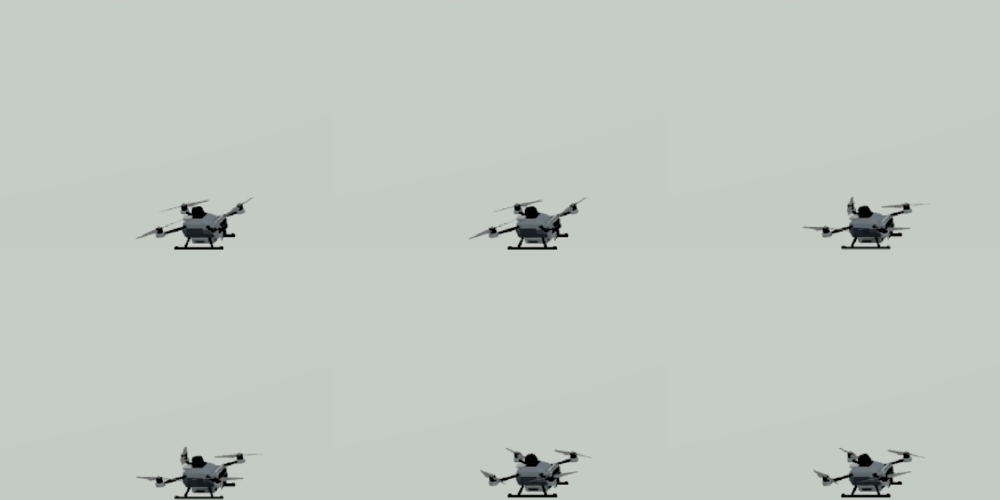
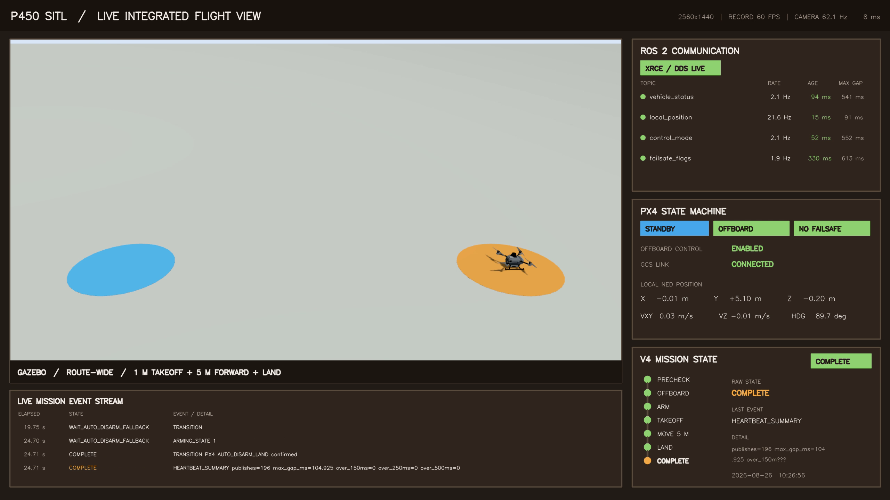
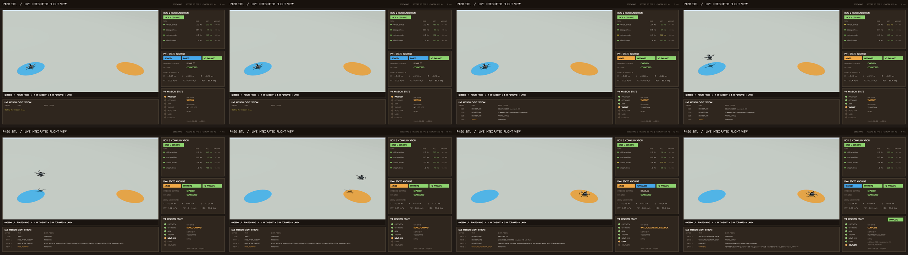

# P450 Gazebo 視覺模型與 1440p60 整合飛行驗證報告

日期：2026-08-26 至 2026-08-27（Asia/Taipei）  
Repository：`DDlic/p450-jetson-handoff`  
基準工作：Issue #1 `P450 Codex Coordination`  
正式測試 ID：`P450_20260826_SITL_INTEGRATED_1440P60_R2`

## 1. 結論

本次工作已完成一套可展示 AMOV P450 大致外型、PX4 SITL 飛行、ROS 2 通訊與
PX4/V4 任務狀態的單畫面錄影。正式 R2 測試完成 1 m 起飛、前進 5 m、PX4
`AUTO_LAND` 與 `AUTO_DISARM_LAND`，任務 exit code 為 0。

| 項目 | 結果 | 證據 |
|---|---:|---|
| P450 大致外型取代 x500 視覺外殼 | PASS | 最終 GLB、SDF 與錄影 |
| 機體離地、起落架不穿透地面 | PASS | 起飛前與落地後影格 |
| 四個槳軸對準 P450 410 mm 對角軸距 | PASS | SDF 靜態量測與連續影格 |
| 槳葉隨 PX4 馬達模型旋轉 | PASS | 6 個連續錄影影格 |
| 單一 route-wide 機位 | PASS | 起點與 5 m 終點全程同框 |
| ROS 2 通訊狀態同畫面 | PASS | topic rate、age、max gap 即時面板 |
| PX4 與 V4 狀態同畫面 | PASS | arming、nav、Offboard、failsafe、mission timeline |
| 2560×1440 H.264 錄影 | PASS | `width=2560`、`height=1440`、`yuv420p` |
| 固定 60 fps 輸出 | PASS | `r_frame_rate=60/1`、`avg_frame_rate=60/1` |
| 1 m／前進 5 m／Land 任務 | PASS | R2 `MISSION_EVENTS.csv` |

這是桌面 SITL 視覺與通訊展示結果，不解除 NX UART freshness、kernel panic、RC-loss、
戶外定位、實機馬達或有槳飛行等 gate。

## 2. 測試環境

- Ubuntu 22.04 x86_64。
- ROS 2 Humble，`px4_msgs release/1.14`。
- PX4 v1.14.3，commit `1dacb4cdef2d7145754fc788fa8dc482eed74b40`。
- Gazebo Garden `gz-sim 7.9.0`；以 repository 的 `GZ_CONFIG_PATH` 避免誤用同機的
  Gazebo Harmonic 8.15.0。
- Micro XRCE-DDS Agent v2.4.2，UDP4 port 8888。
- 顯示器 2560×1440、179.8 Hz；GNOME Wayland，錄影視窗使用 XWayland。
- 任務程式 SHA-256：
  `825966c9e5f978c8cd6c9c39e2367d068187a3d77da10321b62da4b8f1d17f95`。

基礎安裝與相容性修正見
[`P450_UBUNTU22_HUMBLE_SITL_HANDOFF_20260825.md`](../../runbooks/P450_UBUNTU22_HUMBLE_SITL_HANDOFF_20260825.md)。

## 3. 視覺模型修正

### 3.1 機體與地面

- 使用 text-to-CAD 工作產生的簡化 P450 外型作為 `base_link` 視覺 mesh。
- 模擬動力、慣性、感測器與 PX4 bridge 保持已驗證的 x500 baseline；本工作不宣稱
  精確還原機內零件或實機空氣動力。
- spawn 高度固定為 `0.24 m`；機身 GLB 以 `-0.22 m` 視覺位移對齊碰撞腳架。
- base、腳架支柱與兩條 skid 使用獨立 collision box，避免先前機體插入地板的畫面。

最終檔案：

- [`model.sdf`](../../../config/sitl/gz-garden/models/p450_v2/model.sdf)
- [`amov_p450_gazebo_body.glb`](../../../config/sitl/gz-garden/models/p450_v2/meshes/amov_p450_gazebo_body.glb)

### 3.2 槳葉與馬達軸

原本自製槳葉外型接近方形，且沿用 x500 較長臂長時，槳軸落在 P450 馬達外側的空中。
最終版本採以下修正：

- 使用 Gazebo/PX4 x500 原生 `1345_prop_cw.stl` 與 `1345_prop_ccw.stl`。
- 依 P450 410 mm 對角軸距，四個 motor link 的 X/Y 為
  `±0.144956890 m`；計算所得對角 motor distance 為 `0.409999999595 m`。
- 原生槳 mesh 等比例縮放為 254 mm：scale `0.734104258412`。
- 修正原生 STL 的局部原點偏移後，CW 與 CCW 的槳面 bounding-box 中心至 joint
  Z 軸的 XY 誤差均為 `1.34433398379e-09 m`。
- 四個 revolute joint 直接由 `gz::sim::systems::MulticopterMotorModel` 驅動；沒有使用
  額外的假動畫。

連續六個錄影影格顯示槳葉角度逐格改變：



## 4. Route-wide 世界與整合畫面

[`p450_visual.sdf`](../../../config/sitl/gz-garden/worlds/p450_visual.sdf) 提供：

- 藍色起飛點與橘色 5 m 終點。
- 唯一一個 route-wide camera，pose `2.5 -5 3.0 0 0.414 1.571`。
- 相機 sensor 1280×720、60 Hz；實測約 62.1 Hz。
- physics 250 Hz、`max_step_size=0.004`、`real_time_factor=1.0`。

[`p450_live_screen.py`](../../../scripts/p450_live_screen.py) 直接訂閱 Gazebo camera 與以下
ROS 2 topic：

- `/fmu/out/vehicle_status`
- `/fmu/out/vehicle_local_position`
- `/fmu/out/vehicle_control_mode`
- `/fmu/out/failsafe_flags`

畫面配置將 route-wide Gazebo 放在左側，右側顯示 ROS 2 topic rate/age/max gap、PX4
arming/nav/Offboard/failsafe/GCS/NED 狀態，以及 V4 mission timeline；底部保留最近四筆
`MISSION_EVENTS.csv`。



## 5. 錄影方法與規格

Wayland 下直接擷取 X11 root window 只得到黑畫面。正式方法是讓 dashboard 以 XWayland
顯示，再讓 FFmpeg 直接擷取 dashboard window ID，而不是擷取 root compositor。

```bash
source /opt/ros/humble/setup.bash
source "$P450_SITL_ROOT/ros_ws/install/setup.bash"
export GDK_BACKEND=x11
export PYTHONNOUSERSITE=1
python3 scripts/p450_live_screen.py \
  --fps 60 \
  --test-id P450_20260826_SITL_INTEGRATED_1440P60_R2
```

另一個 terminal：

```bash
P450_WINDOW_ID=$(xwininfo -root -tree | \
  awk '/"P450 Integrated Flight View"/ {print $1; exit}')

ffmpeg -y -f x11grab -draw_mouse 0 -framerate 60 \
  -window_id "$P450_WINDOW_ID" -video_size 2560x1440 -i :0.0 \
  -an -c:v libx264 -preset ultrafast -tune zerolatency -crf 18 \
  -threads 8 -pix_fmt yuv420p -movflags +faststart \
  P450_INTEGRATED_1440P60_PASS.mp4
```

正式影片規格：

| 欄位 | 值 |
|---|---:|
| codec | H.264 |
| pixel format | yuv420p |
| resolution | 2560×1440 |
| nominal / average fps | 60/1、60/1 |
| frame count | 2410 |
| duration | 40.167 s |
| size | 9,575,916 bytes |
| SHA-256 | `ba55546c88f66d820da150557555d34bc914e1adbab096a4bda32e891902b662` |

正式影片：[`P450_INTEGRATED_1440P60_PASS.mp4`](../../../evidence/20260826_p450_visual_sitl/P450_INTEGRATED_1440P60_PASS.mp4)

60 fps 而非 120 fps 是刻意選擇：Gazebo camera 實際約 62 Hz，120 fps 只會增加重複
採樣。FFmpeg 輸出確實是固定 60 fps；dashboard 主迴圈在包含錄影前後等待的整個
55.733 s session 中回報 50.347 fps，因此不得把所有 UI 元件宣稱為 60 Hz 原生更新。
這不影響 60 fps 螢幕錄影規格，ROS 2 面板仍依各 topic 的真實 2 Hz／約 22 Hz 更新。

## 6. 對抗式測試紀錄

### 6.1 R1：保留的失敗紀錄

測試 ID：`P450_20260826_SITL_INTEGRATED_1440P60_R1`  
結果：exit 20，任務安全中止。

R1 在 `MOVE_FORWARD` 收到 PX4 `Offboard control signal lost`，任務先要求 Land，接著偵測
PX4/RC 已切換至 nav state 2，立即 relinquish control，沒有繼續發送 Offboard、setpoint、
Land、Arm 或 Disarm。任務 heartbeat 仍是 192 次、max gap 104.812 ms，且沒有任何 gap
超過 150 ms，因此此事件不能歸因於 mission Python loop 的一般 publish 延遲。

當時 Gazebo/PX4 已連續執行約 7 分 38 秒；PX4 console 同時出現 `Failsafe activated` 與
`battery warning (fast)`，模擬電池耗盡是主要推定原因。此根因屬 console 與時序推論，
不是僅由 CSV 能完全證明的結論。後續只冷重啟 PX4/Gazebo、重置模擬電池狀態，沒有修改
任務安全邏輯，再執行 R2。

原始紀錄：[`MISSION_EVENTS_R1_FAIL.csv`](../../../evidence/20260826_p450_visual_sitl/MISSION_EVENTS_R1_FAIL.csv)

### 6.2 R2：正式 PASS

測試 ID：`P450_20260826_SITL_INTEGRATED_1440P60_R2`  
結果：exit 0。

| elapsed | state/event | 結果 |
|---:|---|---|
| 2.230 s | `REQUEST_OFFBOARD` | nav state 14、Offboard enabled |
| 2.281 s | `TAKEOFF` | armed，開始 1 m 起飛 |
| 11.137 s | `HOLD_AFTER_TAKEOFF` | 到達起飛高度 |
| 13.138 s | `MOVE_FORWARD` | 以實際 post-takeoff heading 建立 5 m goal |
| 19.724 s | `REQUEST_LAND` | command 21 |
| 19.751 s | `LAND_MODE_CONFIRMED` | nav state 18 |
| 24.705 s | arming state 1 | PX4 自動解除鎖定 |
| 24.705 s | `COMPLETE` | `PX4 AUTO_DISARM_LAND confirmed` |

R2 heartbeat summary：

```text
publishes=196 max_gap_ms=104.925 over_150ms=0 over_250ms=0 over_500ms=0
```

原始紀錄：[`MISSION_EVENTS_R2_PASS.csv`](../../../evidence/20260826_p450_visual_sitl/MISSION_EVENTS_R2_PASS.csv)

完整階段預覽：



## 7. 重現步驟

先依既有 Ubuntu 22.04/Humble runbook 建好 PX4、ROS 2 與 Agent。再將本 repository 的
模型與世界放入 PX4 checkout：

```bash
cp -a config/sitl/gz-garden/models/p450_v2 \
  "$P450_SITL_ROOT/PX4-Autopilot/Tools/simulation/gz/models/"
cp config/sitl/gz-garden/worlds/p450_visual.sdf \
  "$P450_SITL_ROOT/PX4-Autopilot/Tools/simulation/gz/worlds/p450_visual.sdf"
```

啟動 PX4/Gazebo：

```bash
cd "$P450_SITL_ROOT/PX4-Autopilot"
export PX4_GZ_MODEL=p450_v2
export PX4_GZ_MODEL_POSE=0,0,0.24,0,0,0
export PX4_GZ_WORLD=p450_visual
export GZ_CONFIG_PATH="$P450_REPO/config/sitl/gz-garden"
make px4_sitl gz_x500
```

Agent、localhost-only operator link、資料 bind mount 與 ROS workspace 沿用既有 runbook。
開始 dashboard 與 FFmpeg 後執行：

```bash
python3 scripts/p450_delivery_poc_mission.py --flight \
  --test-id P450_YYYYMMDD_SITL_INTEGRATED_1440P60 \
  --allow-armed \
  --operator-confirmation PROPS_INSTALLED_AREA_CLEAR_KILL_READY \
  --takeoff-height 1 \
  --forward-distance 5
```

長時間 idle 後不要直接開始正式錄影；先冷重啟 PX4/Gazebo 以重置模擬電池，再等待
`Ready for takeoff!`。每次 run 必須使用新的 TEST_ID。

## 8. Artifact hashes

| Artifact | SHA-256 |
|---|---|
| `model.sdf` | `52e02b109c73e914982b35675bfee166cd08afa3300c494d74a9c106488b2bfa` |
| `model.config` | `99ea2ac11367be187d2560931c1ce968c05051239feea9c18f0cb94e14e3861c` |
| `amov_p450_gazebo_body.glb` | `65c2f5175d8137746cf75a4d113115cb2fe0669c0a953c21c67cc3fe28082036` |
| `p450_visual.sdf` | `7a1d24958ea755be5f05654caef62c2d929942e89331d1a903ed8b9ff3982d64` |
| `P450_INTEGRATED_1440P60_PASS.mp4` | `ba55546c88f66d820da150557555d34bc914e1adbab096a4bda32e891902b662` |
| `P450_INTEGRATED_COMPLETE_FRAME.png` | `91368edaa475b826de27b4789b8738101f3f12c0bf6d20fb1e1d0b834e533173` |
| `P450_INTEGRATED_CONTACT_SHEET.png` | `3e5ec1960d731de560b4bec7271d120d66c68e34d9a7deb675a372605c8157ed` |
| `P450_ROTOR_MOTION_6_CONSECUTIVE_FRAMES.png` | `f780bb22f3ea3de1b9bc1bb72ebed4e400bc4c7aa792694ebc349c79075a0c36` |
| `MISSION_EVENTS_R1_FAIL.csv` | `da701cf2bdbae2754ca74039c3a2f517cf4acfa75e88d906091bac21d1457175` |
| `MISSION_EVENTS_R2_PASS.csv` | `359afaf66de1b4ab58836fc9b2d3bce09cbc5cb3c737aaefe08c18a99378e510` |

## 9. 最終判定與限制

本次結果足以作為「P450 外型的 PX4/Gazebo 模擬飛行，以及 ROS 2/PX4 狀態同畫面展示」
的報告證據。模型目的為辨識與視覺展示，不是 P450 的完整 mass/inertia、propeller thrust
curve、ESC、電池、Jetson/Pixhawk 安裝位置或結構強度數位分身。

因此可下的結論是：**視覺展示與桌面 SITL 任務 PASS**。不可延伸為：**NX 實機飛行已
驗證**。NX 後續仍須先依 V4 operator card 完成 P_D、無槳 G_D、0.5 m F1_D，再進入
1 m／5 m F2_D。
